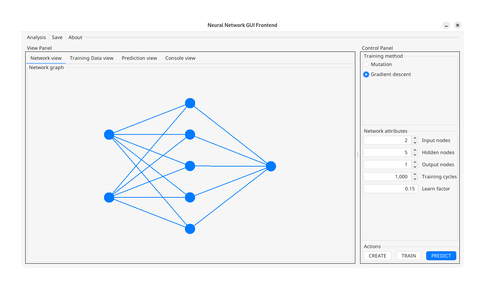

# Java Neural Network

---

###  Overview
This is a collaborative effort to build an open-source neural network engine 
and frontend GUI. As of right now, it's being implemented in pure Java.



GitHub will serve as our primary platform for code.

---

## Table of Contents
1. [Project Goals](#project-goals)
2. [Repository Structure](#repository-structure)
3. [Tech Stack](#tech-stack)
4. [Git Conventions](#git-conventions)
   - [Branching](#branching)
   - [Commits](#commits)
   - [Pull Requests](#pull-requests)
   - [Code Style](#code-style)
5. [Getting Started](#getting-started)
6. [Contribute](#contribute)
7. [Contributors](#contributors)

---

## Project Goals
- Implement a functional Neural Network and each of its components from scratch.
  - Perceptron, training methods, etc.
- Develop a frontend GUI and visualizer for the Neural Network
- Follow structured programming and documentation practices

---

## Repository Structure
```
java-neural-network/


```

---

## Tech Stack
We'll be using the following tools to develop, test, and debug our Neural Network:

- **Programming Language:** [Java](https://www.java.com/en/)
- **GUI Design:** [IntelliJ Swing UI plugin](https://www.jetbrains.com/help/idea/design-gui-using-swing.html#q2ug0v_31)
- **Build System:** [Apache Maven](https://maven.apache.org/)

---

## Git Conventions
To keep our work organized and manageable, we'll adhere to these conventions:

### **Branching**
- **`main` branch:** Stable and working code only
- **Feature branches (`feature/<name>`):** For new features
- **Bugfix branches (`bugfix/<name>`):** For retroactively resolving issues

### **Commits**
To keep things nice and organized, please prepend a relevant **type** seen 
in the table below to your commit message.

Example:  ```feat(gui): Implement neural vetwork visualizer```

| Type      | Purpose |
|-----------|---------|
| **feat**  | Introduces a new feature |
| **fix**   | Fixes a bug |
| **chore** | Maintenance tasks |
| **docs**  | Documentation changes |
| **style** | Formatting, whitespace, missing semicolons, etc. |
| **refactor** | Code restructuring without changing behavior |
| **test**  | Adding or updating tests |
| **perf**  | Performance improvements |
| **build** | Changes to build scripts, dependencies |


### **Pull Requests**
- Always create a PR before merging into `main`.
- PRs should be reviewed.
- Include a description of what the PR does.
- Run tests before submitting a PR.

---

## Getting Started

### **Prerequisites**
This project was created with IntelliJ IDEA, and the GUI frontend is currently
built using the integrated form designer that ships with IntelliJ.

If you're not planning on altering the GUI at all, then
any IDE (or text editor + environment) that supports Java and Maven should suffice.

This project's specified Java version is 23, but most (if not all) of its code is likely backwards-compatible.  If you're unable to work with Java 23, 
you can change the ```maven.compiler.source``` and ```maven.compiler.target``` attributes in the ```pom.xml``` file to 
suit your needs (provided the source code is backwards compatible with your
selection).

### **Procedure**

The following steps are outlined using CLI tools to provide an environment-agnostic
guide to setting this project up. If you want to avoid using the below CLI commands, most 
modern IDEs ship with their own respective GUI tools that achieve the same thing. For instance, 
IntelliJ users can follow [this reference](https://www.jetbrains.com/help/idea/using-git-integration.html).

1. **Clone the repository:**
```shell
  git clone https://github.com/gjinrexhaj/java-neural-network.git
```
3. **Create a feature branch before working on a new task:**
```shell
  git checkout -b feature/<your-feature-name>
```
4. **Commit changes regularly:**
```shell
   git add <changed-files>
   git commit -m "(Type): Message")>
```
5. **Push your branch and create a pull request:**
```shell
   git push origin feature/<your-feature-name>
```

To build this program successfully, use maven to launch ```pom.xml``` with the arguments:
```
clean install
```
Afterward, all compiled Java bytecode and an executable .jar file will be located under a newly created ```target/```
directory.

---

## Contribute
To keep our project organized and productive, please:
- **Open an Issue Before Major Changes**
- **Follow Coding Standards:** Keep naming and formatting consistent, avoid creating spaghetti-code when possible
- **Test Your Code Thoroughly:** Make sure it works before merging.
- **Review PRs:** Look for clarity, correctness, and efficiency.

---

## Contributors
<a href="https://github.com/gjinrexhaj"></a>
<a href="https://github.com/gerti24"></a>
<a href="https://github.com/DuffinC"></a>
<a href="https://github.com/ibrah200"></a>